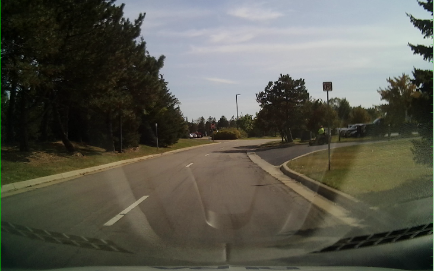
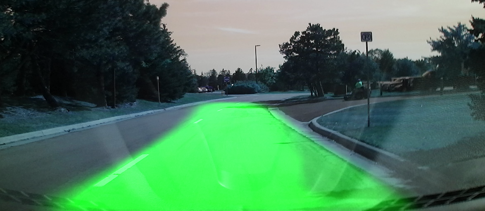

# Lane Detection using CNN model.
# quick start
- Clone this Repository.
` git clone https://github.com/akshitagupta15june/lane_detection_opencv.git`
- Change Directory
`cd Lane detection using Cnn`
- Run code script
`python code.py`

# Screenshot
| Original Image | Detected Image |
| ------------- | ------------- |
|   |   |
