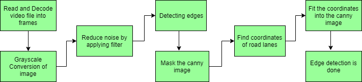
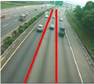
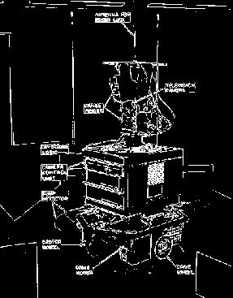
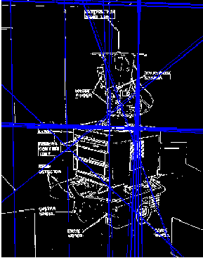
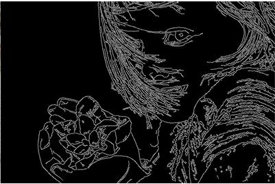
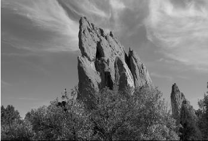
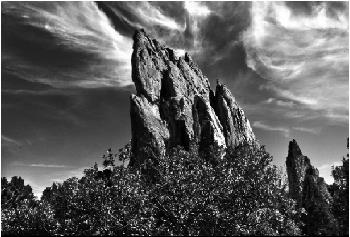

<h1>Lane Detection Opencv</h1>

<h3>Join official <a href="https://discord.gg/Qr8D7thZ">Discord Channel</a> for discussion.</h3>

  

# ORGANIZATIONS IN WHICH THIS PROJECT WAS A PART OF:

## OPEN SOURCE CONTEST STUDENT CODE IN 2020

Student Code-in is a global program that helps students grow with “OPEN SOURCE”.In this,all the registered participants would get an exquisite opportunity to interact with the mentors and the Organizing Team.

 

## NJACK Winter of Code 2020

NWoC (NJACK Winter of Code) is a program by NJACK (The Official Computer Science Club of IIT Patna) that helps students understand the paradigm of Open Source contribution and gives them real world software development experience.

# Working Video (click on gif to watch complete video.)

### The main emphasis of this project is to find the further ways which can be used further to improve the result of lane detection algorithms.

# Lane-Detection-using-OpenCV.

The lane detection has proved to be an efficient technique to prevent accidents in Intelligent Transportation Systems. The review on lane detection has shown that most of the researchers have neglected the problem of the fog and noise in images. Thus noise and fog may reduce the accuracy of the existing systems.
# LANE DETECTION 

Lane coloration has become popular in real time vehicular ad-hoc networks (VANETs). The main emphasis of this
project is to find the further ways which can be used further to improve the result of lane detection algorithms. Noise,
visibility etc. can reduce the performance or the existing lane detection algorithms. The methods developed so far are
working efficiently and giving good results in case when noise is not present in the images. But problem is that they
fail or not give efficient results when there is any kind of noise or fog in the road images. The noise can be anything
like dust, shadows, puddles, oil stains, tire skid marks, etc.

1. Introduction

Traffic accidents have become one of the most serious problems in today's world. Roads are the mostly chosen modes of
transportation and provide the finest connections among all modes. Most frequently occurring traffic problem is the
negligence of the drivers and it has become more and more serious with the increase of vehicles.
Increasing the safety and saving lives of human beings is one of the basic function of Intelligent Transportation
System (ITS). Intelligent transportation systems are advanced applications which aim to provide innovative services relating
to different modes of transport and traffic management. This system enables various users to be better informed and make
safer, more coordinated, and smarter use of transport networks.These road accidents can be reduced with the help of road lanes or white markers that assist the driver to identify the road area and non-road area. A lane is a part of the road marked which can be used by a single line of vehicles as to control and guide drivers so that the traffic conflicts can be reduced.

Technology Stack

OpenCV

Libraries required for this task:
NumPy: It comes by default with anaconda

Matplotlib: To install matplotlib, type – “pip install matplotlib” into your command line

OpenCV: It can be installed in two ways, using anaconda or using pip.

To install using anaconda, type- “conda install -c conda-forge opencv”, or to install using pip, type-
“pip install opencv-python” into your command line 

# Flowchart

Road scene image

Lane detection

To detect road markings and road boundaries various methodologies are used like Hough Transform, Canny edge
detection algorithm, bilateral filter. The main working of all these are as follows:

# A. Probabilistic Hough Transform

Hough transform is a technique in which features are extracted that is used in image analysis and digital image
processing. Previously the classical Hough Transform worked on the identification of lines in the image but later it has been
extended to identifying positions of shapes like circles and ellipses. In automated analysis of digital images, there was a problem of detecting simple geometric shapes such as straight lines, circle, etc. So in the pre-processing stage edge detector has been used to obtain points on the image that lie on the desired curve in image space. But due to some imperfections in image data or in the edge detector, some pixels were missing on the desired curve as well as spacial deviation between the geometric shape used and the noisy edge pixels obtained by the edge detector. So to refine this problem Hough transform is used. In this the grouping of edge pixels into an object class is performed by choosing appropriate pixels from the set of parametric image objects.

Input Image                               Finding lines using Hough Transform

                       

The simplest case of Hough transform is finding straight lines that are hidden in large amounts of image data. For
detecting lines in images, the image is first converted into binary image using some form of thresholding and then the
positive or suitable instances are added into the dataset. The main part of Hough transform is the Hough space. Each point
(d, T) in Hough space matches to a line at angle T and distance d from the origin in the data space. The value of a function
in Hough space gives the point density along a line in the data space.

For each point in the Hough space, consider all the lines which go through that point at an actual discrete set of
angles that are chosen on the priority basis. For each angle T, calculate the distance to the line through the point at that angle and discretize that distance using a priori chosen discretization, giving value d. Now make a corresponding discretization of the Hough space. This will result in a set of boxes in Hough space. These boxes are called the Hough accumulators. For each line it considers above, we increment a count (initialized at zero) in the Hough accumulator at point (d, T). After considering all the lines through all the points, a Hough accumulator with a high value will probably correspond to a line of points.

>>Drawback of Hough Transform - Computing each line with two arguments takes a lot of time in computation. Hence this algorithm drastically increases the time compexity
of our software.
>>Solution - Use optimised version of Hough transform method calles "Probabilistic Hough Transform"

We are using Probabilistic Hough Transform to compute the lines in the binary image. Its efficiency is based on the fact that it does not take all the points into consideration. Instead it takes only a random subset of points that is sufficient for line detection. This progressive method utilises two thresholding parameters
that help in eliminating the unnecessary lines. The OpenCV python function has two new arguments - minLineLength and maxLineGap. All line segments shorter than minLineLength are rejected to avoid extra computation. The parameter maxLineGap is the maximum allowed gap between line segments to treat them as single line. The value of these parameters depends on our dataset and may vary for completely different locations. Currently the parameters are set at the value 40.

 
# B. Edge Detection

Edge detection works on the idea of the identification of points in the digital image at which the image brightness changes
sharply. The points at which image brightness changes sharply are organized into a set of curved line segments termed as
edges. Edge detection is a fundamental tool in image processing particularly in the areas of feature detection and feature
extraction. Applying an edge detection algorithm to an image may significantly reduce the amount of data to be processed
and may therefore filter out information that may be regarded as less relevant, while preserving the important structural
properties of an image. If the edge detection step is successful, the subsequent task of interpreting the information contents in the original image may therefore be substantially simplified. However, it is not always possible to obtain such ideal edges from real life images of moderate complexity.
Edge detection using Canny Edge detection algorithm

  

The Canny edge detector is an edge detection algorithm that uses a multiple stage algorithm so as to detect edges in
images. Its aim is to discover the optimal edge detection. In this definition, an optimal edge detector includes the following things

>>Good detection – the algorithm should be able to detect as many real edges in the image as possible.
>>Good localization – edges marked through this algorithm should approach as close as possible to the edge in the real image.
>>Minimal response – a given edge in the image should only be marked once so as to reduce false edges.

# C. Bilateral filter

Bilateral filter is a simple and non-iterative scheme which smoothens the image while preserving the edges. The basic idea
behind the working of bilateral filter is that the two pixels should be close to one another. This filter split an image into
large-scale features i.e. structure and small scale features i.e. texture.

In this filter every sample is replaced by a weighted average of its neighbors. These weights reflects two forces i.e.
the closeness of the neighborhood with the center sample so that larger weight is assigned to the closer samples, and
similarity between neighborhood and the center sample so that larger weight is assigned to the similar samples.
As it is seen in figures below, the output image is almost similar to the input image inspite of smoothening.

Filtered image using Bilateral Filter

   

An assistive navigation system has been developed for the blind by employing geometric figures
like straight line, parabola, or hyperbola. By combining color and local intensity information, this method detected correctly pedestrian marked lanes in different illumination and weather conditions (sunny, cloudy, strong shadows, times of day).

The color segmentation
procedure identified the yellow and white colored lanes followed by edge orientation in which the boundaries was
eliminated, regions was labeled and finally the lanes was detected. As the height of the camera was relatively constant with
respect to the road surface, the road portion of the image can be exclusively cropped by providing the coordinates, so that
identifying the lanes became much more efficient.

# 3. Conclusion

The lane detection has proved to be an efficient technique to prevent accidents in Intelligent Transportation Systems. The
review on lane detection has shown that the most of the researchers has neglected the problem of the fog and noise in
images. Thus noise and fog may reduce the accuracy of the existing systems. one can use bilateral filter and dark channel
prior methods to improve the results further. In near future we will propose a new technique which will integrate the
performance of lane detection by using bilateral filter.

## Open for Pull requests

## Get Started with Open Source now

[Start Open Source](https://anush-venkatakrishna.medium.com/part-1-winter-or-summer-take-your-baby-steps-into-opensource-now-7d661235d7ff)
an article by [Anush Krishna](https://github.com/anushkrishnav)

